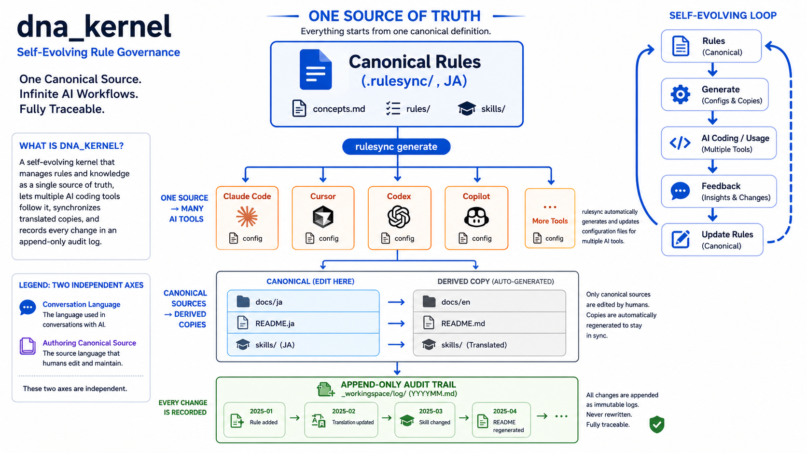

# dna_kernel

[English](README.md) · 日本語

dna_kernel は、LLM ハーネスを使う創作・開発プロジェクトに、
自己発展型ルールガバナンスを注入するための最小カーネルです。

これは単体アプリケーションではなく、既存リポジトリへコピー・統合して使うルール体系です。ルールの正本、AIが実行する手順、各ツール向けの生成設定、完了確認、作業証跡を同じ運用へまとめます。

導入すると、Codex・Claude Code・Cursor・Grok Buildなどを行き来しても、ルールや完了条件を毎回説明し直したり、ツールごとの指示ファイルを別々に修正したりするコストを下げられます。Rulesync 15.0.1は `grokcli` targetとして `.grok/skills/` を生成できますが、実際のGrok Buildがその配置を読むことは導入先で確認します。

主な導入効果:

- `.rulesync/` の正本から複数のAIツール向け設定を生成できる
- ファイル保存・機械検査・チェックリストで「完了」の根拠を残せる
- 追記専用の査証ログで作業事実を追跡できる
- Python標準ライブラリ中心で、日常のRulesync生成にNode.jsを必要としない

最小導入から始める場合は、[導入・注入フロー](docs/ja/dna-kernel/onboarding.md)でプロファイルを選択してください。

主な役割:

- `.rulesync/` にルールとスキルの正本を置く
- rulesync で各 LLM ツール向け設定を生成する
- `_workingspace/` に査証ログ・日記・計画を残す
- `tools/kernel/` の小さな実働ツールで完了確認を支える

詳しい導入・注入手順:

- [Documentation (EN)](docs/en/dna-kernel/README.md)
- [ドキュメント（日本語）](docs/ja/dna-kernel/README.md)

## 謝辞

このプロジェクトは、複数の LLM ツール向け設定を `.rulesync/` から生成する [rulesync](https://github.com/dyoshikawa/rulesync) を利用しています。  
作者の [dyoshikawa](https://github.com/dyoshikawa) さんに感謝します。
